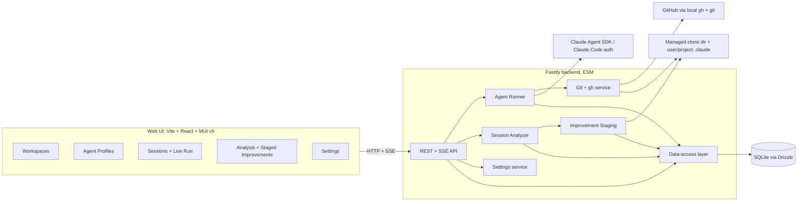
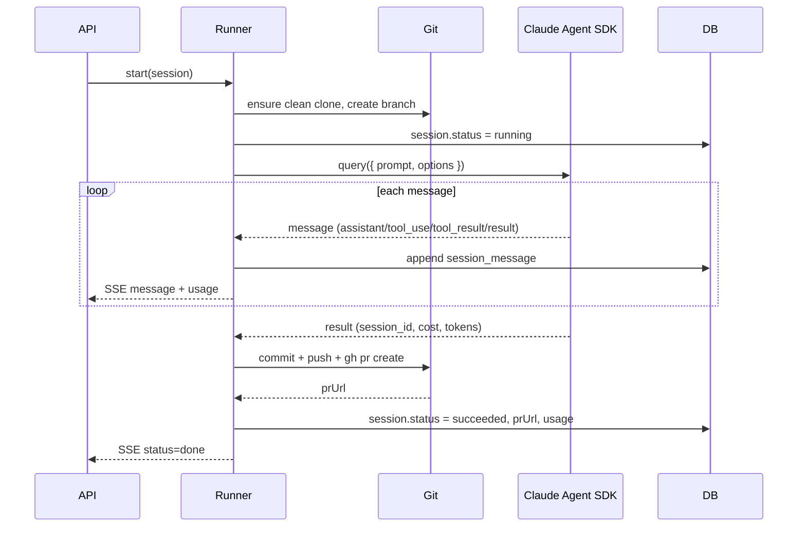
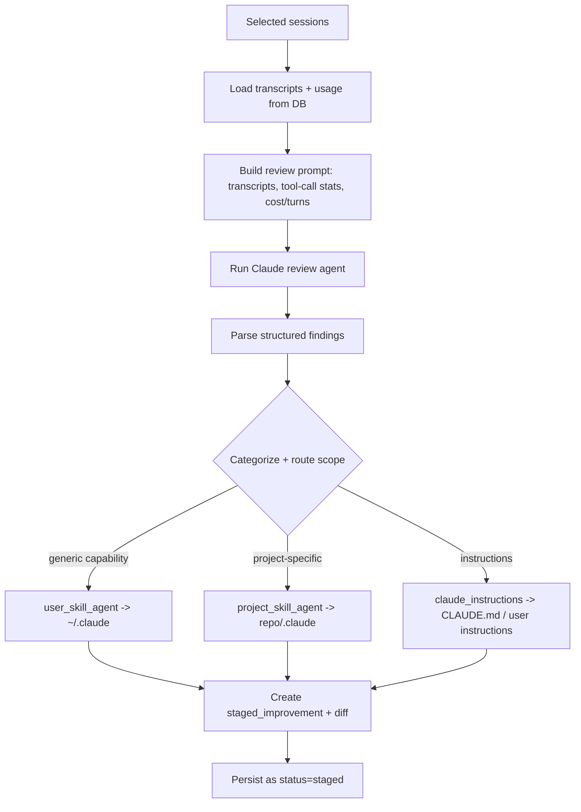

# Architecture

This document describes the target system design. It is the reference future phases implement against. Where a detail is illustrative (schema fields, endpoint names), phases may refine it, but changes to a settled decision require a new ADR in [`decisions.md`](decisions.md).

## 1. High-level system



- The **web UI** is a pure client: it talks to the backend over HTTP and consumes SSE for live session/analysis streams.
- The **backend** owns everything privileged: spawning the SDK, running `git`/`gh`, reading/writing `.claude` files, and persistence.
- **SQLite** holds structured state; the **filesystem** holds clones and the `.claude` instruction/skill files.

## 2. Monorepo layout

```
claude-assistant/
├── apps/
│   ├── server/
│   │   ├── src/
│   │   │   ├── index.ts            # Fastify bootstrap
│   │   │   ├── app.ts              # buildApp() for tests (fastify.inject)
│   │   │   ├── routes/             # workspaces, profiles, sessions, analyses, settings
│   │   │   ├── services/
│   │   │   │   ├── runner/         # Claude Agent SDK integration
│   │   │   │   ├── git/            # git + gh wrappers
│   │   │   │   ├── analysis/       # analyzer + scope routing + staging
│   │   │   │   └── settings/
│   │   │   ├── db/                 # drizzle schema, client, migrations, repositories
│   │   │   └── lib/                # sse, errors, config
│   │   └── vitest.config.ts
│   └── web/
│       ├── src/
│       │   ├── main.tsx
│       │   ├── theme/              # MUI v9 theme (cssVariables, colorSchemes)
│       │   ├── api/                # typed client + SSE hooks
│       │   ├── routes/             # pages
│       │   └── components/
│       └── vitest.config.ts
├── packages/
│   └── shared/                     # zod schemas + inferred types + constants
├── docs/
├── package.json
├── pnpm-workspace.yaml
├── tsconfig.base.json
└── .github/workflows/ci.yml
```

Workspace package names: `@claude-assistant/server`, `@claude-assistant/web`, `@claude-assistant/shared`.

## 3. Data model (Drizzle sketch)

Illustrative shape; Phase 1 finalizes columns and indexes. All ids are text UUIDs; timestamps stored as ISO strings or epoch ms (Phase 1 decides and documents).

```ts
// workspaces
{ id, name, remote, owner, repo, defaultBranch, localPath, createdAt, updatedAt }

// agent_profiles
{ id, name, model, effort, permissionMode,
  allowedTools: json<string[]>, disallowedTools: json<string[]>,
  skills: json<string[] | 'all' | null>, agents: json<AgentDef[] | null>,
  settingSources: json<('user'|'project'|'local')[]>,
  maxTurns, maxBudgetUsd, extraSystemPrompt, isBuiltIn, createdAt, updatedAt }

// sessions
{ id, workspaceId, profileId,
  profileSnapshot: json<AgentProfile>,   // frozen settings actually used
  prompt, status,                        // pending|running|succeeded|failed|canceled
  sdkSessionId, branchName, prUrl,
  inputTokens, outputTokens, totalCostUsd, numTurns,
  startedAt, endedAt, createdAt }

// session_messages  (append-only transcript)
{ id, sessionId, seq, type, subtype, payload: json, tokens: json|null, createdAt }

// analyses
{ id, status, model, effort, summary, sessionIds: json<string[]>, createdAt, endedAt }

// staged_improvements
{ id, analysisId,
  category,        // 'claude_instructions' | 'project_skill_agent' | 'user_skill_agent'
  scope,           // 'user' | 'project'
  workspaceId,     // required when scope = project
  targetPath,      // resolved absolute/relative target file
  rationale, currentContent, proposedContent, diff,
  status,          // 'staged' | 'applied' | 'discarded'
  appliedAt, createdAt }

// app_settings  (single-row/keyed)
{ key, value: json }
```

Notes:
- `sessions.profileSnapshot` decouples history from later profile edits/deletes (see [product-spec §4.2](product-spec.md)).
- `session_messages` is the raw material for analysis; keep it append-only and ordered by `seq`.

## 4. API surface (REST + SSE)

REST is JSON; validated with shared zod schemas. Long-running operations stream via SSE.

| Method | Path | Purpose |
| --- | --- | --- |
| GET/POST | `/api/workspaces` | List / create (verify + clone) workspaces. |
| GET/DELETE | `/api/workspaces/:id` | Get / remove a workspace. |
| GET/POST | `/api/profiles` | List / create agent profiles. |
| GET/PUT/DELETE | `/api/profiles/:id` | Get / update / delete a profile. |
| GET/POST | `/api/sessions` | List / create (and start) sessions. |
| GET | `/api/sessions/:id` | Session detail + transcript. |
| GET | `/api/sessions/:id/stream` | **SSE** live transcript + usage while running. |
| POST | `/api/sessions/:id/cancel` | Cancel a running session. |
| POST | `/api/sessions/:id/messages` | Follow-up prompt (resume). |
| POST | `/api/analyses` | Create an analysis over selected `sessionIds`. |
| GET | `/api/analyses/:id` | Analysis detail + staged improvements. |
| GET | `/api/analyses/:id/stream` | **SSE** live analysis progress. |
| POST | `/api/improvements/:id/apply` | Apply one staged improvement to disk. |
| POST | `/api/improvements/:id/discard` | Discard one staged improvement. |
| GET/PUT | `/api/settings` | Read / update app settings. |
| GET | `/api/health` | Liveness. |

SSE event shape (illustrative): `event: message | usage | status | error`, `data: <json>`. The web client has a reusable `useEventStream` hook.

## 5. Agent runner

Responsibilities: translate an agent profile into SDK `Options`, run `query()`, persist and stream the message flow, and drive the PR at the end.



Profile → `Options` mapping (see [SDK reference](https://code.claude.com/docs/en/agent-sdk/typescript)):

| Profile field | SDK option |
| --- | --- |
| `model` | `model` |
| `effort` | `effort` (`low|medium|high|xhigh|max`) |
| `permissionMode` | `permissionMode` (`default|acceptEdits|bypassPermissions|plan`) |
| `allowedTools` / `disallowedTools` | `allowedTools` / `disallowedTools` |
| `skills` | `skills` |
| `agents` | `agents` |
| `settingSources` | `settingSources` (include `'user'` for auth+user skills, `'project'` for repo `.claude`) |
| `maxTurns` / `maxBudgetUsd` | `maxTurns` / `maxBudgetUsd` |
| workspace clone path | `cwd` |
| `extraSystemPrompt` | appended `systemPrompt` |

Constraints:
- `bypassPermissions` requires `allowDangerouslySkipPermissions: true` and is gated by an app setting; it is never a silent default.
- The SDK is mocked in tests — the runner must accept an injectable `query` implementation.

## 6. Git + GitHub service

- Clones live under the configured managed directory (one clone per workspace).
- Uses the machine's local `git` and `gh`; no token handling in-app.
- Operations: verify access, clone, fetch/pull default branch, create a uniquely named branch per session, stage/commit, push, and `gh pr create`.
- All shell interaction goes through a thin wrapper that is mockable (inject the command executor) and never interpolates untrusted input unsafely.

## 7. Analysis + staging engine



- The analyzer is itself an SDK call (a review agent) using an analysis-specific model/effort from settings; it must return structured findings the engine can parse into staged improvements.
- **Scope routing rule** (enforced and unit-tested): generic skills/agents (plan, implement, code review, etc.) route to **user** scope; project-specific skills/agents route to the workspace's **project** scope. Instructions route to `CLAUDE.md` (project) or user instructions per the finding.
- Staging never writes to disk. `apply` writes `proposedContent` to `targetPath` at the resolved scope; `discard` is a no-op on disk. Both transition the improvement's status and are idempotent.

## 8. Persistence and filesystem boundaries

- **SQLite (Drizzle):** all structured entities in [§3](#3-data-model-drizzle-sketch). One DB file in the app's data directory. Migrations via `drizzle-kit`.
- **Filesystem:** managed clones (per workspace) and the `.claude` instruction/skill files at user scope (`~/.claude`) and project scope (repo `.claude`). Only the git service and staging engine write to the filesystem.

## 9. Testing architecture

- `buildApp()` returns a Fastify instance for `inject`-based route tests with a temp SQLite DB.
- The SDK `query`, and the `git`/`gh` executor, are injected so they can be mocked.
- Web: component/logic tests in Vitest + Testing Library; full flows verified manually and by the Phase 9 e2e.

## 10. Cross-cutting concerns

- **Config/secrets:** none stored; auth delegated (see [decisions.md](decisions.md)).
- **Errors:** typed errors mapped to structured HTTP responses; SSE `error` events for stream failures.
- **Concurrency:** single-user, but multiple sessions may run; each session uses its own branch and the runner serializes writes per workspace clone.
- **Observability:** structured logs on the server; the transcript itself is the primary audit trail.
