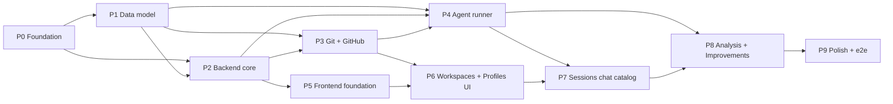

# Backlog

This is the implementation backlog for claude-assistant, broken into phases. It is written to be **consumed by AI agents**: every task is small, self-contained, and has an explicit contract.

Read [`../../AGENTS.md`](../../AGENTS.md), [`../product-spec.md`](../product-spec.md), [`../architecture.md`](../architecture.md), [`../decisions.md`](../decisions.md), and [`../chat-feature-catalog.md`](../chat-feature-catalog.md) first. Those are binding. Session chat has no “v1 subset”: implement every catalog row.

## How to work the backlog

1. Find the lowest-numbered phase that is not complete.
2. Within it, pick the first task whose `Depends on` tasks are all done.
3. Implement strictly within the task's `Files` scope. If you must exceed it, say why in the commit body.
4. Write the tests in `Test requirements`, then make `pnpm test`, `pnpm lint`, and `pnpm typecheck` pass.
5. Commit with a Conventional Commit that references the task id, e.g. `feat(db): P1-T2 add workspace schema and repository`.
6. A task is **done** only when its `Acceptance criteria`, `Test requirements`, and `Done definition` are all satisfied.

Do not cross a phase boundary until the previous phase's tasks are complete, unless a task explicitly says it is parallelizable.

## Task schema

Every task uses this structure:

- **Id** — stable identifier, `P<phase>-T<n>`.
- **Title** — short imperative summary.
- **Goal** — the outcome and why it matters.
- **Depends on** — task ids that must be done first (`—` if none).
- **Files** — files/dirs to create or modify (the allowed scope).
- **Implementation notes** — concrete guidance, constraints, references.
- **Acceptance criteria** — observable conditions that define correctness.
- **Test requirements** — Vitest and/or manual verification required.
- **Done definition** — the final gate (usually: criteria met, tests written and green, lint + typecheck pass).

## Phase index

| Phase | File | Theme | Depends on |
| --- | --- | --- | --- |
| 0 | [`phase-00-foundation.md`](phase-00-foundation.md) | Monorepo, tooling, AI-dev guardrails | — |
| 1 | [`phase-01-data-model.md`](phase-01-data-model.md) | SQLite + Drizzle schema and repositories | 0 |
| 2 | [`phase-02-backend-core.md`](phase-02-backend-core.md) | Fastify app, REST/SSE plumbing, settings | 0, 1 |
| 3 | [`phase-03-git-github.md`](phase-03-git-github.md) | git + gh integration, workspaces | 1, 2 |
| 4 | [`phase-04-agent-runner.md`](phase-04-agent-runner.md) | Claude Agent SDK runner, sessions, PRs | 1, 2, 3 |
| 5 | [`phase-05-frontend-foundation.md`](phase-05-frontend-foundation.md) | Vite/React/MUI v9, theming, API client | 2 |
| 6 | [`phase-06-workspaces-profiles-ui.md`](phase-06-workspaces-profiles-ui.md) | Workspaces + agent profiles UI | 3, 5 |
| 7 | [`phase-07-sessions-ui.md`](phase-07-sessions-ui.md) | Reusable chat (full SDK catalog), sessions list | 4, 6 |
| 8 | [`phase-08-analysis-improvements.md`](phase-08-analysis-improvements.md) | Analysis engine + staged improvements | 4, 7 |
| 9 | [`phase-09-polish-e2e.md`](phase-09-polish-e2e.md) | Polish, empty/error states, e2e, docs | 8 |

## Dependency graph

## Definition of done for the whole product

The product is complete when a user can, entirely from the UI: add a GitHub workspace, manage agent profiles, run a session in the reusable chat that implements [`../chat-feature-catalog.md`](../chat-feature-catalog.md) (including permissions, multi-question AskUserQuestion, and browser restart), open a real PR, and select past sessions to produce categorized, correctly-scoped staged improvements that can be reviewed as diffs and applied or discarded — with light/dark themes working and the Vitest suite green.
