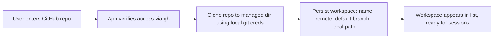
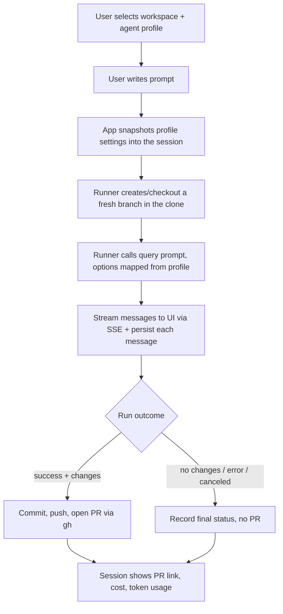
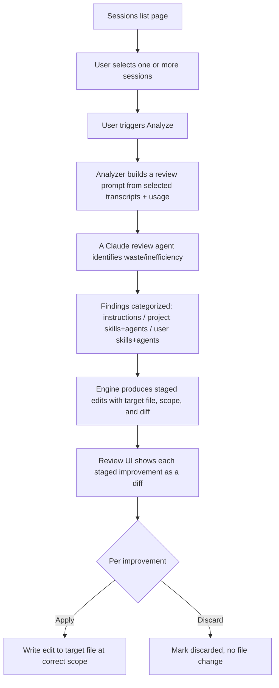

# Product Specification

## 1. Vision

**claude-assistant** is a local-first tool that lets a single developer delegate coding work to the Claude Agent SDK across their GitHub repositories, and then continuously improves the quality of that delegation by analyzing past sessions.

The product has two loops:

- **The delivery loop:** configure an agent, point it at a repo, give it a prompt, and get a pull request.
- **The improvement loop:** analyze completed sessions for waste and inefficiency, and stage concrete improvements to instructions and skills so future sessions are cheaper, faster, and better.

## 2. Users and assumptions

- Exactly one user, running the app on their own machine.
- The user has a working Claude Code login and a working `gh`/`git` login.
- The user is technically proficient and comfortable reviewing diffs, PRs, and agent transcripts.
- No authentication, authorization, or multi-tenancy is required.

## 3. Core concepts (entities)

| Concept | Description |
| --- | --- |
| **Workspace** | A GitHub repository the user wants agents to work in. Cloned locally to a managed directory. Owns default branch info and local clone path. |
| **Agent Profile** | A reusable, named bundle of Claude Agent SDK settings: model, effort, permission mode, authorized (allowed/disallowed) tools, enabled skills/subagents, and limits (`maxTurns`, `maxBudgetUsd`). Managed independently and reused across sessions. |
| **Session** | One agent run: a prompt executed against a workspace using an agent profile. Owns status, the streamed transcript, token/cost usage, the created branch, and the resulting PR link. |
| **Session Message** | A single persisted event from the SDK stream (assistant text, tool use, tool result, system, result). Append-only; the transcript of a session. |
| **Analysis** | The result of analyzing one or more selected sessions for waste/inefficiency. Owns a summary and a set of findings. |
| **Staged Improvement** | A concrete, reviewable proposed edit produced by an analysis, targeting a specific file at a specific scope (user or project), in one of three categories. Has a lifecycle: staged → applied or discarded. |
| **App Settings** | Global configuration: managed clone directory, default agent profile, Claude Code `settingSources` defaults, analysis model/effort, etc. |

## 4. User flows

### 4.1 Add a workspace

- Input: repository reference (e.g. `owner/name` or URL).
- The app uses the local `gh`/`git` credentials to verify access and clone.
- Failures (no access, bad ref, clone error) are surfaced clearly and do not create a half-initialized workspace.

### 4.2 Manage agent profiles

- Full CRUD. A profile edits every configurable SDK setting the app supports.
- Fields: `name`, `model`, `effort`, `permissionMode`, `allowedTools`, `disallowedTools`, `skills`, `agents` (subagents), `settingSources`, `maxTurns`, `maxBudgetUsd`, and an optional extra `systemPrompt` append.
- Deleting a profile that is referenced by historical sessions must preserve those sessions' recorded settings (sessions snapshot the profile values used at run time).
- Ships with sensible built-in default profiles (e.g. a conservative "plan-first" profile and a "build + PR" profile).

### 4.3 Create and run a session

- The prompt and profile are required; the workspace determines `cwd`.
- The run streams live: assistant messages, tool calls, and tool results appear as they happen, along with running token/cost totals.
- The user can cancel a running session.
- On success with file changes, the runner commits, pushes a branch, and opens a PR using `gh`. The PR URL is stored on the session.
- Sessions are resumable via the SDK `session_id`/`resume` where applicable (follow-up prompt in the same session).

### 4.4 Analyze sessions and stage improvements

- Analysis is **manual** and **explicit**: nothing is analyzed or applied automatically.
- The engine looks for waste and inefficiency signals: redundant tool calls, repeated file reads, thrash/backtracking, oversized context, excessive turns relative to task size, high cost for low output, ignored existing conventions, etc.
- Findings become **staged improvements** in three categories with strict scope routing:
  - **Claude instructions** → `CLAUDE.md` (project scope) or user instructions (user scope) as appropriate.
  - **Project skills/agents** → the workspace repo's `.claude/` — **only** when the improvement is specific to that project.
  - **User skills/agents** → user scope `~/.claude/` — for generic capabilities (e.g. plan, implement, code review) that are not project-specific.
- Each staged improvement is presented as a reviewable diff. The user applies or discards each one individually. Applying writes to the correct file/scope; discarding changes nothing on disk.
- Scope routing is a first-class rule: generic skills must never be written to a project, and project-specific skills must never be written to user scope.

## 5. Configuration surface

All agent behavior is configurable. Nothing about the agent run is hard-coded that a user might reasonably want to change:

- Per agent profile: model, effort, permission mode, allowed/disallowed tools, skills, subagents, setting sources, turn/budget limits, extra system prompt.
- Global app settings: managed clone directory, default profile, default `settingSources`, analysis model/effort, and whether `bypassPermissions` is permitted at all.

## 6. Non-goals (this product)

- No hosting/multi-user/accounts.
- No support for non-Claude model providers (the SDK is Claude-only by design).
- No secret/key management UI — auth is delegated to Claude Code and local `gh`/`git`.
- No automatic (unattended) application of improvements — staging and manual review are mandatory.
- No repository hosting other than GitHub in the first iterations.

## 7. Success criteria for the product

- A user can add a repo, create a profile, run a session, and receive a real PR — entirely from the UI, with live streaming.
- A user can select past sessions, run an analysis, and review categorized, correctly-scoped staged improvements as diffs, then apply or discard each.
- Light and dark themes both look correct and are toggleable.
- All logic is covered by Vitest; UI flows are verified in the running app.
